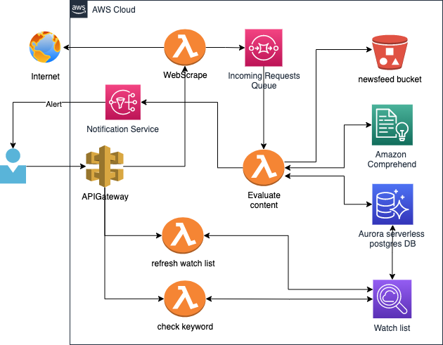

# Building a scalable real-time newsfeed watchlist using Amazon Comprehend
One of the challenges businesses have is to constantly monitor information via media outlets and be alerted when a key interest is picked up, such as
individual, product, or company information. One way to do this is to scan media and news feeds against a company watchlist. The list may contain
personal names, organizations or suborganizations of interest, and other type of entities (for example, company products). There are several reasons why a
company might need to develop such a process: reputation risk mitigation, data leaks, competitor influence, and market change awareness.

In this post, I will share with you a prototype solution that combines several AWS Services: Amazon Comprehend, Amazon API Gateway, AWS Lambda, and
Amazon Aurora Serverless. We will examine the solution architecture and I will provide you with the steps to create the solution in your AWS environment

## Introduction
There are three components we need to set up. 

1. Web Scraping API
2. Evaluate content and extract features
3. Matching logic and notification

To begin, we need to set an API that will be able to scrap a webpage - say news article(but not necessarily), extract and clean the content and push the request into a processing queue(so that we can scale) - in this implementation we use python library [BeautifulSoup](https://www.crummy.com/software/BeautifulSoup/bs4/doc/). 

Next, We need a process that will be able to evaluate and analyze the given input text, To achieve this task, we use [Amazon Comprehend](https://aws.amazon.com/comprehend/)
to use the built-in ML features such as extracting entities, keyphrases and sentiment. In addition, Amazon Comprehend provides us with a score/confidence level which we can use to filter out entities or terms which do not pass a certain threshold(we use 90% confidence).

Lastly, we are going to need to have a matching logic and actionable result when a match happens. to address the matching logic, we will use A [Fuzzy Name Matching](https://en.wikipedia.org/wiki/Fuzzy_matching_(computer-assisted_translation)#:~:text=Fuzzy%20matching%20is%20a%20technique,a%20database%20of%20previous%20translations.)
and two algorithms which supporting that - [Levenshtein distance](https://en.wikipedia.org/wiki/Levenshtein_distance) and [Soundex](https://en.wikipedia.org/wiki/Soundex#:~:text=Soundex%20is%20a%20phonetic%20algorithm,despite%20minor%20differences%20in%20spelling.).
To have a scalable and effective execution for the matching logic, we use [Amazon Aurora Serverless](https://aws.amazon.com/rds/aurora/serverless/) with a postgres engine which support the two algorithms described.
When a match occurs, we need to create a notification so that we can take action. We use [Amazon SNS](https://aws.amazon.com/sns/). with an email subscriber to notify the user. Additional subscribes can be attached to the same topic for automated action.  

## Architecture


### Walkthrough
The preceding architecture shows an Event-driven design. To interact with the solution we use API Lambda functions which are initiated upon user
request. Following are the high-level steps.
1. Create a watchlist. Use the “Refresh_watchlist” API to submit new data, or load existing data from a CSV file located in a bucket. More details in the
   following “Loading Data” section.
2. Make sure the data is loaded properly and check a known keyword. Use the “check-keyword” API. More details in the following “Testing” section.
3. Once the watchlist data is ready, submit a request to “query_newsfeed” with a given newsfeed configuration (url, document section qualifier) to
   submit a new job to scan the content against the watchlist. Review the example in the “Testing” section.
4. If an entity or keyword matched, you will get a notification email with the match results.

#### Technical Walkthrough
When a new request to “query_newsfeed” is submitted. The Lambda handler extracts the content of the URL and creates a new message in the
‘Incoming Queue’.
Once there are available messages in the incoming queue, a subscribed Lambda function is invoked “evaluate content”. Thistakes the scraped
content from the message and submits it to Amazon Comprehend to extract the desired elements (entities, key phrase, sentiment).
The result of Amazon Comprehend is passed through a matching logic component, which runs the results against the watchlist (Aurora Serverless
Postgres DB), utilizing Fuzzy Name matching.
If a match occurs, a new message is generated for Amazon SNS which initiates a notification email.
To deploy and test the solution we follow four steps:
1. Create infrastructure
2. Create serverless API Layer
3. Load Watchlist data
4. Test the match
   The code for Building a Scalable real-time newsfeed watchlist is available in this [GitHub Repository](https://github.com/aws-samples/realtime-newsfeed-analysis-watchlist-using-comprehend).

### Prerequisites
You will need an [AWS account](https://console.aws.amazon.com/) and a [Serverless Framework CLI Installed](https://www.serverless.com/framework/docs/providers/aws/guide/installation/).


#### Security Best Practices
Before setting up your environment, make sure to review the below best practices, and make customizations to comply with your security standards.
* Deploy the API and [Lambda in your private VPC](https://docs.aws.amazon.com/lambda/latest/dg/configuration-vpc.html),  learn more about [deploying serverless in a VPC](https://www.serverless.com/framework/docs/providers/aws/guide/functions#vpc-configuration)
* Protect your [APIGateway using a WAF](https://docs.aws.amazon.com/apigateway/latest/developerguide/apigateway-control-access-aws-waf.html)
* Check [AWS Amazon Managed rules for WAF](https://docs.aws.amazon.com/waf/latest/developerguide/aws-managed-rule-groups.html)
* Check serverless plugin for [WAF association](https://www.serverless.com/plugins/serverless-associate-waf)
* Review [Security Best Practices for Amazon Simple Storage Service](https://docs.aws.amazon.com/AmazonS3/latest/userguide/security-best-practices.html)
* Review [Security Best Practices for AWS Key Management Service](https://docs.aws.amazon.com/kms/latest/developerguide/best-practices.html)
* Learn how to approve Amazon Comprehend at [FSI Service Spotlight](https://aws.amazon.com/blogs/industries/fsi-service-spotlight-amazon-comprehend/)


## Creating the infrastructure
I recommend reviewing these resources to get started with: Amazon Aurora Serverless, Lambda, Amazon Comprehend, and Amazon S3.
To begin the procedure:
1. Clone the GitHub repository to your local drive.
2. Navigate to “infrastructure” directory.
3. Use CDK or AWS CLI to deploy the stack:

*update your email below
```bash
aws cloudformation deploy --template RealtimeNewsAnalysisStack.template.json --stack-name RealtimeNewsAnalysis --parameter-overrides notificationemailparam=yourEmailGoesHere@YourEmailDomain.com
```
if using CDK,
```
cdk synth --parameters notificationemailparam=yourEmailGoesHere@YourEmailDomain.com
```
```
cdk deploy --parameters notificationemailparam=yourEmailGoesHere@YourEmailDomain.com
```
One of the outputs of this process is the secret name(RNASecret-aMc3AJ5qC4CN) where all the configurations are located, we need to capture that for the next step:
```
Outputs:
RealtimeNewsAnalysisStack.LambdaRole = arn:aws:iam::******:role/RNAlambdaRole
RealtimeNewsAnalysisStack.SecretName = arn:aws:secretsmanager:us-east-2:******:secret:RNASecret-aMc3AJ5qC4CN-otAmp8
RealtimeNewsAnalysisStack.incomingnewsfeedqueue = arn:aws:sqs:us-east-2:******:RealtimeNewsAnalysisStack-Queue4A7E3555-1M4NICPK142BG
RealtimeNewsAnalysisStack.newsfeedbucket = arn:aws:s3:::realtimenewsanalysisstack-newsfeedbucket275e202e-hzuq8d7by8fc
RealtimeNewsAnalysisStack.snsnotificationtopic = arn:aws:sns:us-east-2:******:RealtimeNewsAnalysisStack-NewsfeedMatchTopic52EAA42C-1TUP5HMBAJBFP
```
## Create servereless API.
Navigate back to the root directory and into the “serverless” directory.<br>

Install serverless-python-requirements:
```
sls plugin install -n serverless-python-requirements
```

Install serverless application
```
sls deploy
```
Output should provide you with the three endpoint deployed:
```
endpoints:
  POST - https://9jrg57k6k6.execute-api.us-east-2.amazonaws.com/dev/query_newsfeed
  POST - https://9jrg57k6k6.execute-api.us-east-2.amazonaws.com/dev/refresh_watchlist
  POST - https://9jrg57k6k6.execute-api.us-east-2.amazonaws.com/dev/check-keyword
```
## Define our Watch list
There are two ways to defined our watch list, either as a web service call(see below) or as a csv file which is uploaded to the newsfeed bucket.

### Web service call
We can use the refresh watchlist API to recreate the list with the provided list in the message. use a tool like Postman to send a POST web service call to the refresh_watchlist
. Set the message body to RAW - Json:
```json
{
    "refresh_list_from_bucket": false,
    "watchlist": [
        {"entity":"Mateo Jackson", "entity_type": "person"},
        {"entity":"AnyCompany", "entity_type": "organization"},
        {"entity":"Example product", "entity_type": "product"},
        {"entity":"Alice", "entity_type": "person"},
        {"entity":"Li Juan", "entity_type": "person"}
    ]
}
```

### CSV watchlist
Locate your newsfeed bucket(see step 1 output). and upload a CSV file "watchlist.csv"(no header required) under a directory "watchlist" in the newsfeed bucket(create the directory)
example:

| Entity               | Entity Type   |
| -------------        |:-------------:|
| Mateo Jackson        | person        | 
| AnyCompany           | organization  |
| Example product      | product       |
| Alice                | person       |
| Li Juan              | person        |

your-generated-bucket/watchlist/watchlist.csv <br>
Once uploaded, call the refresh_watchlist API to refresh the list from the CSV file:
```json
{
    "refresh_list_from_bucket": true,
    "watchlist": []
}
```

## Testing The Match Logic
You can use the dedicated check keyword API to test against a list of keywords to see the match works. - this is not utlizing Amazon comprehend, but it can verify the list is loaded properly and match against a given criteria.
Message sample:
```json
{
    "keywords": ["Alise", "Lee Juan"]
}
```
notice - the spelling mistake for alise with an "s" instead of "c", and, the pronunciation of Li is spelled as Lee.
Both returned as a match. <br>
Results:
```json
{
  "results": [
    {
      "ResponseMetadata": {
        "RequestId": "2eb48458-caa3-4dde-b709-3ba2c72b703d",
        "HTTPStatusCode": 200,
        "HTTPHeaders": {
          "x-amzn-requestid": "2eb48458-caa3-4dde-b709-3ba2c72b703d",
          "content-type": "application/json",
          "content-length": "136",
          "date": "Mon, 19 Jul 2021 13:44:38 GMT"
        },
        "RetryAttempts": 0
      },
      "numberOfRecordsUpdated": 0,
      "records": [
        [
          {
            "stringValue": "Alice"
          },
          {
            "stringValue": "person"
          },
          {
            "stringValue": "2021-07-19 13:43:21.753405"
          }
        ]
      ]
    },
    {
      "ResponseMetadata": {
        "RequestId": "f3db85de-978f-498e-97eb-03226f75b748",
        "HTTPStatusCode": 200,
        "HTTPHeaders": {
          "x-amzn-requestid": "f3db85de-978f-498e-97eb-03226f75b748",
          "content-type": "application/json",
          "content-length": "138",
          "date": "Mon, 19 Jul 2021 13:44:38 GMT"
        },
        "RetryAttempts": 0
      },
      "numberOfRecordsUpdated": 0,
      "records": [
        [
          {
            "stringValue": "Li Juan"
          },
          {
            "stringValue": "person"
          },
          {
            "stringValue": "2021-07-19 13:43:21.782319"
          }
        ]
      ]
    }
  ]
}
```

## Testing News Article
We can test an online content with our watchlist and get notified when a match happens.
```json
{
  "url":"https://en.wikipedia.org/wiki/Alice_and_Bob",
  "html_tag":"div",
  "html_attribute":{
    "class": "mw-parser-output"
  },
  "options": {
    "extract_entities": "true",
    "extract_keyphrase": "true",
    "extract_sentiment": "true"
  }
}
```
Check your mailbox, you should get an email with the match results

## Effectiveness of the solution
1. To support high volume of queries, the solution use Amazon SQS to retain the messages/news articles that needs to be process, so that, there could be multiple producers of content query without impacting previous transactions.
2. Using Amazon Comprehend Entity Detection allows the solution to use built-in Machine learning to detect entities and use them as query against the watchlist.
3. Using Postgres implementation of Levenshtein distance and soundex which are tuned and designed to work against long lists, is effective in performing the fuzzy name matching and can support thousands of records.
4. Using Aurora serverless allow the Database to scale automatically thus processing more queries faster when the load is high in a cost effective way.

## References
https://docs.aws.amazon.com/comprehend/latest/dg/how-entities.html <br>
https://docs.aws.amazon.com/comprehend/latest/dg/how-key-phrases.html <br>
https://aws.amazon.com/rds/aurora/serverless/ <br>
https://aws.amazon.com/sqs/ <br>
https://www.postgresql.org/docs/9.1/fuzzystrmatch.html <br>
https://www.serverless.com/framework/docs/getting-started/ <br> 
